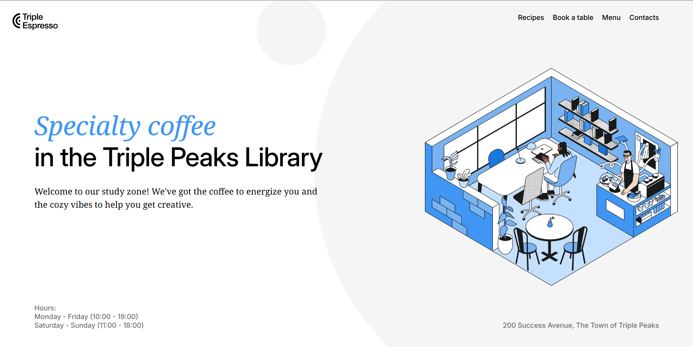

# Triple Peaks Coffee Shop

This is the second project of the Software Engineering program at TripleTen. It was created using HTML and CSS, based on the design brief.

## Project features

- Semantic HTML5
- Flexbox
- Positioning
- Flat BEM file structure
- A custom form
- CSS animation and transform

## Plan on improving the project

### Important content needed

- Add a real terms and agreement pop up page before checking.
- Send confirmation email when booking a table.

### Add Useful Features

- Order online
- Show a calendar for booking tables so it allows you to see the availability.

### Visual Improvements

- Sepearte the menu into another page and show more pictures.
- Embed a map to show the location of the store.
- Add more pictures of the coffee shop
- Show picture of resusable cups
